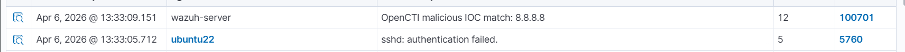

# Wazuh & OpenCTI Threat Intelligence Integration

This repository provides an end-to-end framework for deploying OpenCTI and natively integrating it with Wazuh. This integration provides powerful, real-time threat intelligence (TI) matching against OpenCTI observables and indicators without significant overhead.




## Folder Structure

- `docker/` - Contains the sample `docker-compose.yml` and `.env` template for deploying OpenCTI.
- `wazuh/integrations/custom-opencti.py` - The Python script to query the OpenCTI GraphQL API.
- `wazuh/integrations/custom-opencti` - The shell wrapper script required by Wazuh to execute the Python script.
- `wazuh/etc/ossec.conf.snippet` - The configuration blocks to add to `/var/ossec/etc/ossec.conf`.
- `wazuh/rules/opencti.xml` - Custom Wazuh decoder/rule definitions to trigger alerts.

## 1. OpenCTI Deployment

Launch the OpenCTI cluster and its TI connectors (URLHaus, AlienVault, ThreatFox, MITRE).

1. Edit `docker/.env` and replace all `YOUR_*` placeholder values (like `YOUR_OPENCTI_IP`, `YOUR_OPENCTI_ADMIN_TOKEN`, etc.) with strong, randomly generated secrets and your actual IP address.
2. Deploy the containers:
   ```bash
   cd docker
   docker compose up -d
   ```
3. Wait for the OpenCTI platform to boot (usually 2-5 minutes) and for the connectors to pull their initial feed data.

> Note: This repository contains only basic configuration for the Docker Compose file and the .env file. You can modify it based on your requirements to better suit your needs.

## 2. Setting Up the Integration Script on Wazuh manager

The Python script receives alert data directly from Wazuh, extracts standard observable fields (like `srcip`, `md5`, `domain`), and queries OpenCTI's GraphQL API. 

1. Copy both `wazuh/integrations/custom-opencti` and `wazuh/integrations/custom-opencti.py` to `/var/ossec/integrations/`.
2. Edit `/var/ossec/integrations/custom-opencti.py` and ensure `YOUR_OPENCTI_IP` points to your deployment.
3. Set the correct permissions so the Wazuh user can execute both scripts:
   ```bash
   chown root:ossec /var/ossec/integrations/custom-opencti*
   chmod 750 /var/ossec/integrations/custom-opencti*
   ```

## 3. Configuring Wazuh (ossec.conf)

You must tell Wazuh to trigger this script for relevant security events, and then instruct it to parse the TI matches that the script outputs.

1. Open your `/var/ossec/etc/ossec.conf`.
2. Grab the contents of `wazuh/etc/ossec.conf.snippet` and paste them inside your `<ossec_config>` section. 
3. **CRITICAL**: In the newly pasted `<integration>` block, replace `YOUR_OPENCTI_ADMIN_TOKEN` and `YOUR_OPENCTI_IP` with your actual authentication token and IP.

## 4. Deploying TI Rules

When a match is found in OpenCTI, the script logs the JSON output directly to `/var/ossec/logs/opencti.log`. To generate actual UI alerts from this log file, we need specialized rules.

1. Copy `wazuh/rules/opencti.xml` to `/var/ossec/etc/rules/`.
2. Ensure the permissions are correct:
   ```bash
   chown wazuh:wazuh /var/ossec/etc/rules/opencti.xml
   ```

## 5. Restart and Test

Restart the Wazuh manager to ingest the custom rule and start the integration daemon:

```bash
systemctl restart wazuh-manager
```

### Simulating a Threat Match
To verify your rule is loaded correctly and parses the JSON, you can simulate a match using `wazuh-logtest`:

```bash
echo '{"integration":"opencti","event_type":"threat_intel","timestamp":"2026-04-06T12:00:00.000+0000","agent":{"id":"001","name":"test-agent","ip":"192.168.1.100"},"rule":{"id":"12345","level":5,"description":"Test alert"},"ioc":{"type":"ip","value":"8.8.8.8","source_field":"data.srcip","direction":"src"},"opencti":{"matched":true,"match_count":1,"observable_matches":[{"id":"3ea09846-e7ad-4826-9035-227a30633862","entity_type":"IPv4-Addr","value":"8.8.8.8","score":50,"description":null,"labels":[]}],"indicator_matches":[]}}' | /var/ossec/bin/wazuh-logtest
```
You should see it output: `**Alert to be generated` for Rule 100701.

---

